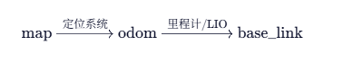
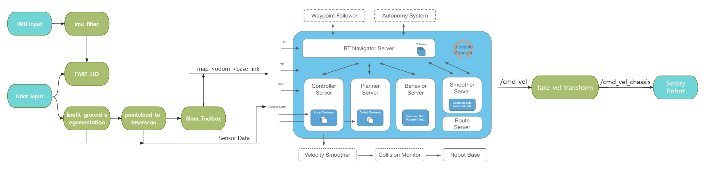

# 一.运行

## ***1.1 基础运行***
```sh
# 查看端口
ls /dev/ttyACM* /dev/ttyUSB* /dev/ttyShaobing 
# 单独编译 
colcon build --symlink-install --packages-select rm_serial_driver
# 启动通讯
ros2 launch rm_serial_driver rm_serial_driver.launch.py
# 源码全编译
colcon build --symlink-install --parallel-workers 1
colcon build --symlink-install
# 关闭 Gazebo 服务器 (物理引擎) 和 客户端 (GUI)
killall gzserver gzclient
```

## ***1.2 基础说明***  

`world`:
- `RMUL` - [2024 Robomaster 3V3 场地](https://bbs.robomaster.com/forum.php?mod=viewthread&tid=22942&extra=page%3D1)
- `RMUC` - [2024 Robomaster 7V7 场地](https://bbs.robomaster.com/forum.php?mod=viewthread&tid=22942&extra=page%3D1)
- `RMUL2026H` - [2026 Robomaster 3V3 场地](https://bbs.robomaster.com/article/814728?source=8)

`坐标`：
- `map → odom`：由 `slam_toolbox`（建图或定位模式）发布。
- `odom → base_link`：由底盘驱动或里程计节点（如 `fast_lio`、point_lio、仿真底盘）发布。
- base_link：机器人本体坐标系

|流程|
|:--:|
||


`规划算法`：
- 全局规划器：`NavfnPlanner`（Dijkstra）
- 局部规划器：`TEB`（Timed Elastic Band）
- `spatio_temporal_voxel_layer/SpatioTemporalVoxelLayer (STVL)`:
    - 它能将 3D 点云转换为 2D 代价地图，并具有时间衰减机制（voxel_decay），能自动过滤掉移动的动态障碍物（如行人），非常适合非静态环境。

|功能包流程图|
|:--:|
||

## ***1.3 仿真模式示例***

- 边建图边导航

```sh
ros2 launch rm_nav_bringup bringup_sim.launch.py \
world:=RMUL2026H \
mode:=mapping \
lio:=fastlio \
lio_rviz:=False \
nav_rviz:=True
```

- 已知全局地图导航

```sh
ros2 launch rm_nav_bringup bringup_sim.launch.py \
world:=RMUL2026H \
mode:=nav \
lio:=fastlio \
localization:=slam_toolbox \
lio_rviz:=False \
nav_rviz:=True
# ---------------
slam_toolbox 
amcl 
icp
```

## ***1.4 真实模式***

- 边建图边导航

```sh
ros2 launch rm_nav_bringup bringup_real.launch.py \
world:=YOUR_WORLD_NAME \
mode:=mapping  \
lio:=fastlio \
lio_rviz:=False \
nav_rviz:=True
```

- 已知全局地图导航

```sh
ros2 launch rm_nav_bringup bringup_real.launch.py \
world:=YOUR_WORLD_NAME \
mode:=nav \
lio:=fastlio \
localization:=slam_toolbox \
lio_rviz:=False \
nav_rviz:=True
```


# 二.实车适配关键

## [***<ins>远程连接***]()
1. vscode-ssh
2. windterm-serial
3. 显示器/显示屏-HDMI
4. mobexterm-以太网

## [***<ins>2.0 局域网下ROS节点共享***](~/.bashrc)
1. WSL中启动rviz2
    - [.wslconfig]("C:\Users\31320\.wslconfig"): 配置镜像网卡
    - 关闭防火墙
```sh
export RMW_IMPLEMENTATION=rmw_fastrtps_cpp
export ROS_DOMAIN_ID=3
```
2. 启动 `foxglove_bridge`
```sh
ros2 launch foxglove_bridge foxglove_bridge_launch.xml
```

## [***<ins>2.1 Gazebo***]()
1. ###  [***<ins>livox_laser_simulation_RO2***](src/rm_simulation/livox_laser_simulation_RO2) - MID360 gazebo-仿真包

2. ### [***<ins>pb_rm_simulation***](src/rm_simulation/pb_rm_simulation): 启动仿真 
    - #### 1. 建模地图
        - [在GAZEBO仿真中用Blender搭建属于你自己的模型](https://www.bilibili.com/video/BV1rT4y1P7HN?vd_source=88bb42a2740f685e0c9f04c776268297)
    - #### 2. 静态地图
        - `rviz`最上面有`panels`—— `slam_toolbox` 可以直接生成，但是如果需要较好的精修的图那就需要—— ***<ins>编辑 .pgm，通过 rosbag<==> db3（需要双ROS环境）生成 .posegraph .data***
            - .pgm 
            - .yaml
            - .data
            - .posegraph
        - 改动处加有：#thth
        - `meshes`里面加地图的`stl`
        - `world`里面加地图的`.world`
    - #### 3. 动态避障
        - [动态障碍](src/rm_simulation/pb_rm_simulation/world/obstacles)
            - 里面的 `README.md` 有详细说明
        - **`amd与arm需要重新生成.so库`**

```sh
# 单独编译
colcon build --packages-select pb_rm_simulation
# 查看 TF
ros2 run tf2_tools view_frames
# 启动仿真
ros2 launch pb_rm_simulation rm_simulation.launch.py world:=RMUL2026H
```


## [***<ins>2.2 Driver***]()
1. ### [***<ins>Livox-SDK2***](Livox-SDK2) - MID360 硬件-驱动包
2. ### [***<ins>livox_ros_driver2***](src/rm_driver/livox_ros_driver2) - MID360 ROS-驱动包
3. ### [***<ins>rm_serial_driver***](src/rm_driver/rm_serial_driver): 串口通信节点
    - [params.yaml](src/rm_driver/rm_serial_driver/params/params.yaml): 限速
    - [test_cmd_vel_pub.py](src/rm_driver/rm_serial_driver/src/test_cmd_vel_pub.py)  : 模拟发布 `/cmd_vel`
```sh
# 查看端口
ls /dev/ttyACM* /dev/ttyUSB* /dev/ttyShaobing 
# 单独编译 
colcon build --symlink-install --packages-select rm_serial_driver
# 启动通讯
ros2 launch rm_serial_driver rm_serial_driver.launch.py
# 测试下位机
python3 src/rm_driver/rm_serial_driver/src/test_cmd_vel_pub.py
```

## [***<ins>2.3 Processing***]()
1. ### [***<ins>fake_vel_transform***](src/rm_navigation/fake_vel_transform)
    - 底盘跟随云台`<不使用？？？>`
        - 使用虚拟坐标变换
        - `不使用速度变换`
    - spin_speed 角速度替换？？？

```sh
colcon build --packages-select fake_vel_transform
# 指定编译 /src/processing下的所有包
colcon build --base-paths src/processing
```
2. ### [***<ins>imu_complementary_filter***](src/rm_perception/imu_complementary_filter)
3. ### [***<ins>pointcloud_to_laserscan***](src/rm_perception/pointcloud_to_laserscan)
4. ### [***<ins>linefit_ground_segementation_ros2***](src/rm_perception/linefit_ground_segementation_ros2)


## [***<ins>2.4 Localization***]()
```sh
colcon build --base-paths src/localization
```

1. ### [***<ins>FAST_LIO***](src/localization/FAST_LIO)
2. ### [***<ins>point_lio***](src/localization/point_lio)
3. ### [***<ins>icp_registration***](src/localization/icp_registration) - icp 定位算法

## [***<ins>2.5 Navigation***]()
```sh
colcon build --base-paths src/navigation
```

1. ### [***<ins>costmap_converter***](ssrc/navigation/costmap_converter)
- ##### 没有 Costmap Converter 时：`传感器 → Costmap (栅格) → TEB (TEB 自己费力地从栅格里猜障碍物形状)`
- ##### 有 Costmap Converter 时：`传感器 → Costmap (栅格) → Costmap Converter (插件) → 几何障碍物列表 (Polygons) → TEB`
2. ### [***<ins>teb_local_planner***](src/navigation/teb_local_planner)
3. ### [***<ins>rm_navigation***](src/localization/src/navigation/rm_navigation)
- nav2 stack 总启动
- amcl 定位算法
- 插件式 plugin 集成
    1. 定位插件 (AMCL)
        - `nav2_amcl::OmniMotionModel`
    2. 局部路径规划插件 (Controller Server)
        - `teb_local_planner::TebLocalPlannerROS`
        - `costmap_converter::CostmapToPolygonsDBSMCCH`
    3. 全局路径规划插件 (Planner Server)
        - `nav2_navfn_planner/NavfnPlanner`
    4. 代价地图插件 (Costmaps)
        - 局部代价地图 (local_costmap): 
            - nav2_costmap_2d::ObstacleLayer
            - nav2_costmap_2d::InflationLayer
        - 全局代价地图 (global_costmap)
            - nav2_costmap_2d::StaticLayer
            - `spatio_temporal_voxel_layer/SpatioTemporalVoxelLayer (STVL)`
            - nav2_costmap_2d::InflationLayer
    5. 行为树导航插件 (BT Navigator)
    6. 恢复行为插件 (Recoveries Server)
        - nav2_recoveries/Spin
        - nav2_recoveries/BackUp


## [***<ins>2.6 rm_nav_bringup***](src/rm_nav_bringup)

### 1. 注意: 
- [nav2_params_real.yaml](src/rm_nav_bringup/config/reality/nav2_params_real.yaml)可以直接用[nav2_params_sim.yaml](src/rm_nav_bringup/config/simulation/nav2_params_sim.yaml)覆盖
- 栅格地图文件和 pcd 文件需具为相同名称，分别存放在，启动导航时 world 指定为文件名前缀即可：
    - src/rm_nav_bringup/map 
    - src/rm_nav_bringup/PCD 

```sh
colcon build --symlink-install --packages-select rm_nav_bringup
ros2 service call /map_save std_srvs/srv/Trigger
```

### 2. `localization` (仅 `mode:=nav` 时本参数有效)
1. `localization` ( 我的理解 ) ：
    - mapping == 不用提供地图
    - nav + slamtoolbox == yaml + pam + data + posegraph
    - nav + amcl == yaml + pam
    - nav + icp == yaml + pam + pcd
2. 使用 [slam_toolbox](https://github.com/SteveMacenski/slam_toolbox) localization 模式定位，动态场景中效果更好
    - 若使用 slam_toolbox 定位，需要提供 `.posegraph 地图`，详见 [如何保存 .pgm 和 .posegraph 地图？](https://gitee.com/SMBU-POLARBEAR/pb_rmsimulation/issues/I9427I)。地图名需要与 `YOUR_WORLD_NAME` 保持一致
    - slam 出来的 map ( pgm + yaml ) 原点就是建图时的起点，小车的初始位置可以通过 `map_start_pose` 与 `2D Estimate` ( rviz 里面的 ) 来调整   
3. 使用 [AMCL](https://navigation.ros.org/configuration/packages/configuring-amcl.html) 经典算法定位
    - 启动后需要在 rviz2 中手动给定初始位姿
4. 使用 [icp_registration](https://github.com/baiyeweiguang/CSU-RM-Sentry/tree/main/src/rm_localization/icp_registration)，仅在第一次启动或者手动设置 /initialpose 时进行点云配准。获得初始位姿后只依赖 LIO 进行定位，没有回环检测，在长时间运行后可能会出现累积误差
    - 若使用 ICP_Localization 定位，需要提供 .pcd 点云图
    - 保存点云 pcd 文件：需先在 [fastlio_mid360.yaml](src/rm_nav_bringup/config/reality/fastlio_mid360_real.yaml) 中 将 `pcd_save_en` 改为 `true`，并设置 .pcd 文件的路径，运行时新开终端输入命令 `ros2 service call /map_save std_srvs/srv/Trigger`，即可保存点云文件


# 三.话题分析

## ***gazebo***
```sh
colcon build --symlink-install --packages-select rm_nav_bringup
source install/setup.bash
ros2 launch rm_nav_bringup gazebo.launch.py \
world:=RMUL2026H
#--------------------------------------------------------------------------
/clock            # Gazebo仿真时钟，同步所有节点时间
/cmd_vel_chassis  # 底盘速度指令，控制机器人运动
/joint_states      # 关节状态，机器人各关节位置/速度
/livox/imu         # Livox雷达IMU数据，加速度/角速度
/livox/lidar       # Livox雷达原始数据
/livox/lidar/pointcloud # Livox雷达点云数据，环境感知
/parameter_events  # 参数变更事件，参数服务器通知
/performance_metrics # 性能指标，系统/节点性能监控
/robot_description # 机器人URDF描述，构建模型与TF
/rosout            # 日志输出，调试与监控
/tf                # 动态坐标变换，实时TF关系
/tf_static         # 静态坐标变换，固定TF关系
```
## ***processing***
```sh
colcon build --symlink-install --packages-select rm_nav_bringup
source install/setup.bash
ros2 launch rm_nav_bringup processing.launch.py
#--------------------------------------------------------------------------
/cmd_vel               # 通用速度指令，部分节点/仿真底盘使用
/imu/data              # IMU原始数据，惯性测量
/local_plan            # 局部路径规划结果
/scan                  # 激光雷达2D扫描数据
/segmentation/ground   # 地面分割结果，障碍物检测
/segmentation/obstacle # 障碍物分割结果，环境感知
```
## ***lio***
```sh
colcon build --symlink-install --packages-select rm_nav_bringup
source install/setup.bash
ros2 launch rm_nav_bringup lio.launch.py \
lio:=fastlio \
lio_rviz:=False
python3 /opt/ros/humble/lib/python3.10/site-packages/tf2_tools/view_frames.py
#---------------------------------------------------------
/Laser_map              # LIO建图生成的激光地图
/Odometry                # LIO估算的里程计（姿态+位置）
/cloud_effected          # LIO滤波后的点云
/cloud_registered        # LIO配准后的点云
/cloud_registered_body   # LIO配准后的车体点云
/path                    # 路径规划结果
```
## ***localization***
```sh
colcon build --symlink-install --packages-select rm_nav_bringup
source install/setup.bash
ros2 launch rm_nav_bringup localization.launch.py \
mode:=nav \
localization:=slam_toolbox 
python3 /opt/ros/humble/lib/python3.10/site-packages/tf2_tools/view_frames.py
#---------------------------------------------------------
/initialpose           # 初始位姿设定，定位/建图起点
/map                    # slam_toolbox建图生成的栅格地图
/map_metadata             # 地图元数据（分辨率、原点等）
/pose                    # slam_toolbox定位结果（机器人位姿）
/slam_toolbox/feedback   # slam_toolbox反馈信息
/slam_toolbox/graph_visualization # 位姿图可视化
/slam_toolbox/scan_visualization  # 激光扫描可视化
/slam_toolbox/update     # 地图更新通知
```
## ***navigation***
```sh
colcon build --symlink-install --packages-select rm_nav_bringup
source install/setup.bash
ros2 launch rm_nav_bringup navigation.launch.py \
nav_rviz:=True
python3 /opt/ros/humble/lib/python3.10/site-packages/tf2_tools/view_frames.py
#---------------------------------------------------------
/behavior_server/transition_event      # 行为服务器状态切换
/behavior_tree_log                        # 行为树日志
/bond                                     # 节点间心跳/连接监控
/bt_navigator/transition_event            # 行为树导航器状态切换
/clicked_point
/cmd_vel_nav                              # 导航规划器速度指令
/controller_server/transition_event       # 控制器状态切换
/diagnostics                              # 系统诊断信息
/downsampled_costmap                      # 降采样后的局部地图
/downsampled_costmap_updates              # 局部地图更新
/global_costmap/costmap                   # 全局代价地图
/global_costmap/costmap_raw               # 全局原始代价地图
/global_costmap/costmap_updates           # 全局地图更新
/global_costmap/footprint                 # 全局机器人足迹
/global_costmap/global_costmap/transition_event # 全局地图状态切换
/global_costmap/published_footprint       # 全局已发布足迹
/global_costmap/voxel_grid                # 全局体素网格
/global_costmap/voxel_marked_cloud        # 全局体素障碍点云
/global_plan                              # 全局路径规划结果
/goal_pose
/local_costmap/costmap                    # 局部代价地图
/local_costmap/costmap_raw                # 局部原始代价地图
/local_costmap/costmap_updates            # 局部地图更新
/local_costmap/footprint                  # 局部机器人足迹
/local_costmap/local_costmap/transition_event # 局部地图状态切换
/local_costmap/published_footprint        # 局部已发布足迹
/local_costmap/voxel_marked_cloud         # 局部体素障碍点云
/map_updates                              # 地图更新通知
/mobile_base/sensors/bumper_pointcloud    # 碰撞传感器点云
/obstacles                                # 障碍物信息
/odom                                     # 里程计
/particle_cloud                           # 粒子滤波定位云
/plan                                     # 路径规划原始结果
/plan_smoothed                            # 平滑后的路径
/planner_server/transition_event          # 路径规划器状态切换
/smoother_server/transition_event         # 路径平滑器状态切换
/speed_limit                              # 速度限制
/teb_feedback                             # TEB规划器反馈
/teb_markers                              # TEB规划器可视化标记
/teb_markers_array                        # TEB规划器批量标记
/teb_poses                                # TEB规划器轨迹点
/velocity_smoother/transition_event       # 速度平滑器状态切换
/via_points                               # 路径via点
/waypoint_follower/transition_event       # 路径跟随器状态切换
/waypoints                                # 路径点列表
```
